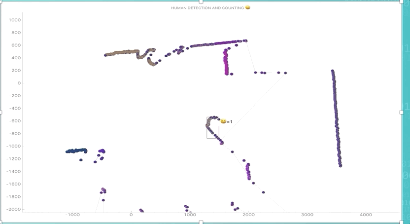

# lidarproj

## About

Indoor localization and tracking of humans demand accurate position of subjects which can be of great use in several applications that includes activity classification and autonomous person tracking. The main objective of this project is to distinguish individual humans to count and track the subject from LIDAR (Light Detection and Ranging) data. The primary objective of this project is to develop a code to detect, track people in the environment from passive LIDAR data.
In this project, it aims to make use of a clustering algorithm for robust detection and tracking from laser scanners placed at hip height level and distinguish the humans from other objects through supervised machine learning techniques. The project involves the collection of data from HOKUYO UST-30LX scanning laser rangefinder. The setup uses an Ethernet interface for communication and can obtain measurement data in a wide field up to 10 meters with millimetre resolution.
A supervised machine learning model has been developed to classify the detected objects to be human or non-human with the help of clustering algorithms at a success rate of 78.25 percent. It further investigates more methods and practices to improve the accuracy in- person tracking with respect to LIDAR data. The method has been implemented using the Numpy, pyKalman, pyqtgraph, scikit-learn, and other publicly available software packages.

## Requirements:

Virtual Environment 

Do refer the attached report to understand the project better.

## How To Install and Run the Project :

All project related code and files is present in the supporting materials along with the report. The entire project is created in the virtual python environment which can be activated and quickly run the application files without requiring any installation of libraries. There are three python files created to execute the three problem phases separately. The DATAPREPARE.py processes the dataset in the CSV format collected from the sensor where it converts the dataset into 2D array and serializes the object. This program is used to convert all collected training and test datasets. The feature_export.py reduces the dimensionality of the previous files and extracts features required to be fed to the model. The model_creator.py program is used to build the supervised machine learning model from the pickle files created in the previous program. The final program detection.py uses the model file and test data object from the previous programs. The pickled machine learning model file and the test data file is required for the detection.py to detect and display the human count. The serialised files of test and training data are provided in the folder ‘pickled files’. All important parts of the code are well documented with the comments and showcased on Github.

## DEMO

http://www.giphy.com/gifs/dt0N8kHaVrqGGkOTXP

## Contributing 

Pull requests are welcome. For major changes, please open an issue first to discuss what you would like to change.

Please make sure to update tests as appropriate.

## License
[MIT](https://choosealicense.com/licenses/mit/)
